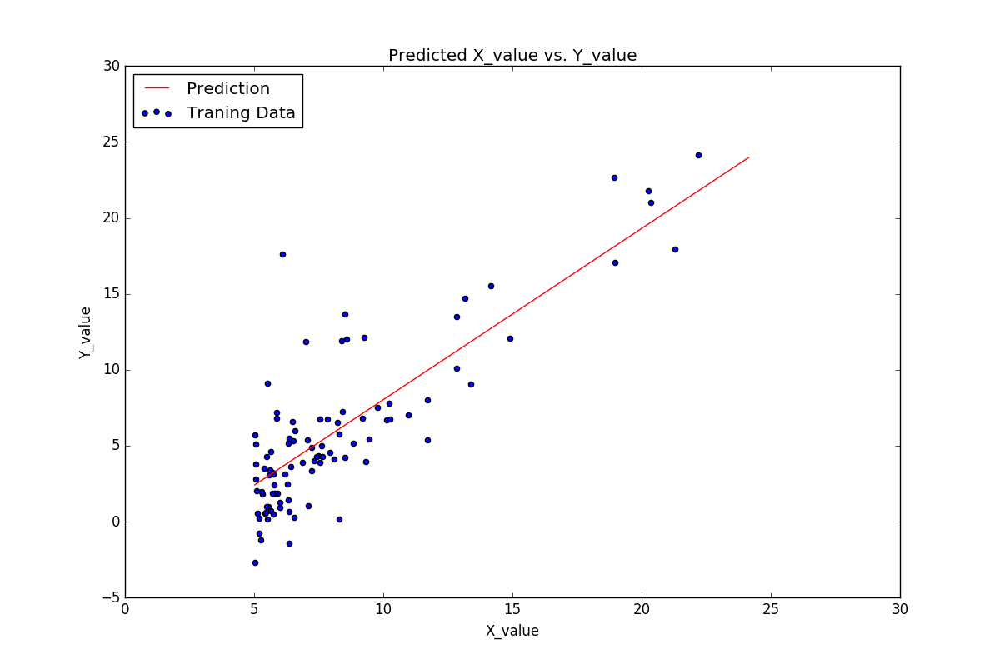

# linear_regression_demo
This is the challenge code for "How to Make a Prediction - Intro to Deep Learning #1' by Siraj Raval on YouTube

##Dependencies

* pandas
* scikit-learn
* matplotlib

You can just run
`pip install -r requirements.txt` 
in terminal to install the necessary dependencies. Here is a link to [pip](https://pip.pypa.io/en/stable/installing/) if you don't already have it.

##Usage

Type `python challenge.py` into terminal and you'll see the scatter plot and line of best fit appear.

##Challenge

The challenge for this video is to use scikit-learn to create a line of best fit for the included 'challenge_dataset'. Then, make a prediction for an existing data point and see how close it matches up to the actual value. Print out the error you get. You can use scikit-learn's [documentation](http://scikit-learn.org/stable/documentation.html) for more help. These weekly challenges are not related to the Udacity nanodegree projects, those are additional.

##Output

*Bonus points if you perform linear regression on a dataset with 3 different variables*

##Credits

The credits for the original code go to [gcrowder](https://github.com/gcrowder). I've merely created a wrapper to get people started.

